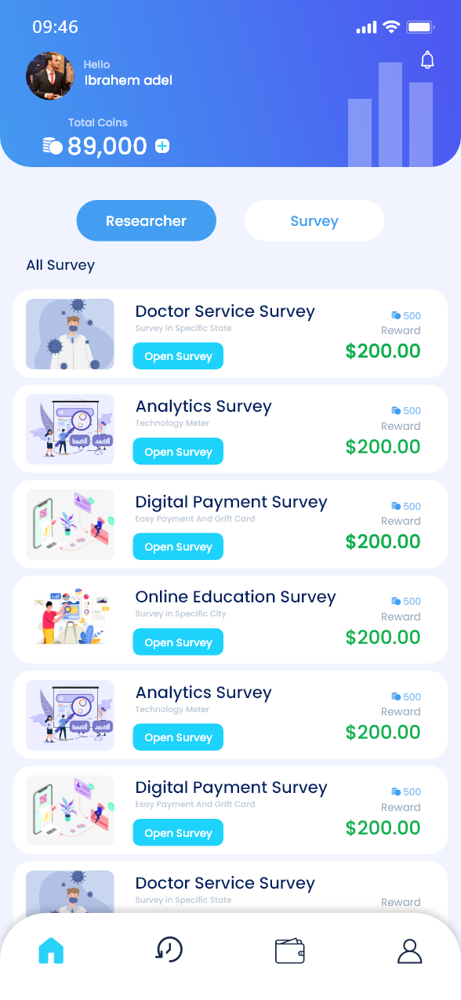

# Yalla Survey

It is a template app that allows the user to answer and create surveys - which any user can add later - and get money in return. Simple UI/UX was translated into code with bloc state management.

## Features:
- Interactive elements.
- Real-time bond information updates.
- Clean and modular code following Flutter best practices.
- State management using Bloc.
- Responsive design for various device sizes.
- Dynamic card updates with a brief, semi-transparent overlay.

## Responsive Design:

- Challenge: Ensuring responsiveness on different devices.
- Solution: Employed responsive design principles, including flexible layouts and media queries.

## Contribution:
- Contributions are welcome! Feel free to open issues, submit pull requests, or suggest improvements.

## Screenshots:
- Sign Up Screen.

  
  
  

- Home Screen.

  
  
  

